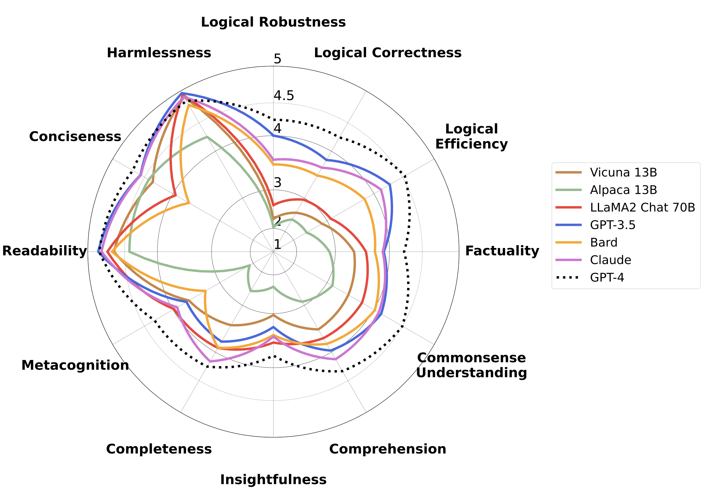

<p align="center" width="100%">
<a href="" target="_blank">

# FLASK: Fine-grained Language Model Evaluation Based on Alignment Skill Sets

[](https://www.python.org/downloads/release/python-390/)
[](https://github.com/psf/black)

This is the official github repository for [FLASK: Fine-grained Language Model Evaluation Based on Alignment Skill Sets](https://arxiv.org/abs/2307.10928).

<p align="center">
  
</p>


## News
[July 21, 2023] Initial release: We released the first version of FLASK! Also check out the <a href="https://kaistai.github.io/FLASK">interactive demo</a>.


## Overview
This is the repository for the FLASK project, a task-agnostic evaluation protocol of language model with fine-grained instance-wise skill set as metrics.

## Evaluation
This code repository contains the implementation of model-based implementation of FLASK. For guidelines for human-based evaluation, refer to the <a href="https://arxiv.org/abs/2307.10928">paper</a>.

### Step 1. OpenAI API Information
Since our model-based evaluation is based on GPT-4 evaluation, you need to add your OpenAI API key into the file of `openai_info/api_info.json` where you need to add your key in `api_keys` list. Note that we also support multiple keys for faster evaluation.

### Step 2. Model Inference
If you want to inference a model on the evaluation set of FLASK, run the following command.

```
cd model_output
python inference.py --model-path {model_path} --model-id {model_id} --question-file ../input_data/flask_evaluation_raw.jsonl --answer-file {output_directory} --num-gpus {num_gpus}
```

We provide the inference results of various LLMs on `model_output/outputs` directory. Note that for the inference of FLASK-Hard, you can simply replace the `--question-file` argument to `../evaluation_set/flask_hard_evaluation.jsonl`.

### Step3. Model Evaluation
After inference, we can evaluate the model using FLASK evaluation protocol. Run the following command for evaluation.

```
cd gpt_review
python gpt4_eval.py -q '../evaluation_set/flask_evaluation.jsonl' -a {answer_file} -o {output_review_file} -e {output_error_file}
```

Note that the error file exists for instances that fail due to rate limit of OpenAI API. If the error file is created after inference, you can rerun only the error instances by running the following command:

```
cd gpt_review
python gpt4_eval.py -q {output_error_file} -a {answer_file} -o {output_review_file} -e {new_output_error_file}
```

We provide the GPT-4 evaluation result of various models in `gpt_review/outputs` directory. 

### Step4. Aggregation and Analysis
After evaluation, FLASK enables fine-grained analysis depending on the skills, domains, and the difficulty levels. 

For analyzing the performance for each `skill`, run the following command:

```
cd gpt_review
python aggregate_skill.py -m {output_review_file}
```

For analyzing the performance for each skill depending on the `difficulty`, run the following command:

```
cd gpt_review
python aggregate_difficulty_skill.py -m {output_review_file}
```

For analyzing the performance for each `domain`, run the following command:

```
cd gpt_review
python aggregate_domain.py -m {output_review_file}
```

## Metadata Annotation
We also provide the implementation of the process of automatic metadata annotation of FLASK. 

### Step 1. OpenAI API Information
Since our model-based evaluation is based on GPT-4 evaluation, you need to add your OpenAI API key into the file of `openai_info/api_info.json` where you need to add your key in `api_keys` list. Note that we also support multiple keys for faster evaluation.

### Step 2. Domain Annotation
For domain metadata annotation, run the following command:

```
cd metadata_annotation/domain
python domain_annotation.py -o {output_domain_annotation} -e {output_domain_annotation_error} 
```

We define 10 different domains revising the domain categorization of Wikipedia. Note that the error file exists for instances that fail due to rate limit of OpenAI API. If the error file is created after inference, you can rerun only the error instances.


### Step 3. Skillset Annotation
For skillset annotation, run the following command:

```
cd metadata_annotation/skillset
python skillset_annotation.py -q {output_domain_annotation} -o {output_skill_annotation} -e {output_skill_annotation_error}
```

We define 12 skills for fine-grained evaluation of LLMs. 

### Step 4. Difficulty Annotation
For difficulty level annotation, run the following command:

```
cd metadata_annotation/difficulty
python difficulty_annotation.py -q {output_skill_annotation} -o {output_difficulty_annotation} -e {output_difficulty_annotation_error}
```

We define 5 different difficulty levels depending on the domain knowledge. Note that after Step 4, each row of the `output_difficulty_annotation` file should have the same format as the row of `evaluation_set/flask_evaluation.jsonl`.

## Online demo
Check out the <a href="https://kaistai.github.io/FLASK">interactive demo</a>!

### Team members
<a href="https://seonghyeonye.github.io/">Seonghyeon Ye*</a>,  <a href="https://github.com/doeyoungkim">Doyoung Kim*</a>, <a href="https://github.com/DSKSD">Sungdong Kim</a>, <a href="https://github.com/hbin0701">Hyeonbin Hwang</a>, <a href="https://github.com/seungonekim">Seungone Kim</a>, <a href="https://github.com/dreamgonfly">Yongrae Jo</a>, <a href="https://jamesthorne.com/">James Thorne</a>, <a href="https://juhokim.com/">Juho Kim</a>, and <a href="https://seominjoon.github.io/">Minjoon Seo</a>. <br/>
(* denotes equal contribution)

### Release
We release the evaluation code of the FLASK. We also plan to release the pip version of FLASK including analysis code in the near future. Stay Tuned!


### Citation

Please cite if you use the data or code in this repo.

```
@misc{ye2023flask,
      title={FLASK: Fine-grained Language Model Evaluation based on Alignment Skill Sets}, 
      author={Seonghyeon Ye and Doyoung Kim and Sungdong Kim and Hyeonbin Hwang and Seungone Kim and Yongrae Jo and James Thorne and Juho Kim and Minjoon Seo},
      year={2023},
      eprint={2307.10928},
      archivePrefix={arXiv},
      primaryClass={cs.CL}
}
```
