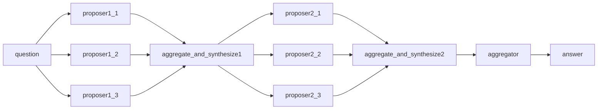

# Mesop Langgraph Chatbot
## Goal
- Implement MoA with langgraph
- Demonstrate MoA Chatbot with Mesop

## Installation
### Python
1. Install [poetry](https://python-poetry.org/docs/#installation)
2. Run `poetry install` in this directory.
3. Run `poetry shell` to use venv
### Ollama
1. [Install ollama](https://ollama.com/download)
2. Install below models(proposers, aggregator)

## Run demo
1. `mesop src/mesop_langgraph/main.py`
2. `Open /chat`
3. Chat!


## Design
### MoA Architecture

- Proposer Layer: 2
- Aggregator Layer: 1
### LLMs
#### Proposers
- [gemma:2b-instruct](https://ollama.com/library/gemma:2b-instruct)
    - temperature: 0.2
- [qwen2:1.5b-instruct-fp16](https://ollama.com/library/qwen2:1.5b-instruct-fp16)
    - temperature: 0.2
- [phi3:3.8b-instruct](https://ollama.com/library/phi3:3.8b-instruct)
    - temperature: 0.2
#### Aggregator
- [qwen2:7b-instruct](https://ollama.com/library/qwen2:7b-instruct)
    - temperature: 0.2
### Prompts
Aggregate-and-Synthesize Prompt
```plaintext
<<SYSTEM>>
You have been provided with a set of responses from various open-source models to the latest user query. Your
task is to synthesize these responses into a single, high-quality response. It is crucial to critically evaluate the
information provided in these responses, recognizing that some of it may be biased or incorrect. Your response
should not simply replicate the given answers but should offer a refined, accurate, and comprehensive reply
to the instruction. Ensure your response is well-structured, coherent, and adheres to the highest standards of
accuracy and reliability.
Responses from models:
1. [Model Response from Ai,1]
2. [Model Response from Ai,2]
...
n. [Model Response from Ai,n]

Human: [x_i]
```

## References
- [Langgraph](https://langchain-ai.github.io/langgraph/)
- [Mesop](https://google.github.io/mesop/)