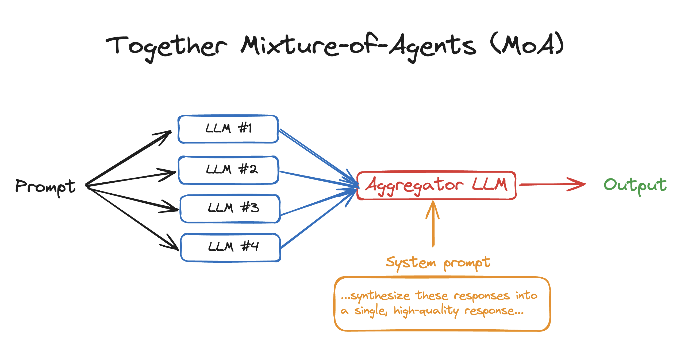

# Mixture-of-Agents (MoA)

[](LICENSE)
[](https://arxiv.org/abs/2406.04692)
[](https://discord.com/invite/9Rk6sSeWEG)
[](https://twitter.com/togethercompute)

<a href="https://www.pdftochat.com/">
  
</a>

<p align="center">
  <a href="#overview"><strong>Overview</strong></a> ·
  <a href="#quickstart-moa-in-50-loc"><strong>Quickstart</strong></a> ·
  <a href="#interactive-cli-demo"><strong>Demo</strong></a>
  ·
  <a href="#evaluation"><strong>Evaluation</strong></a>
  ·
  <a href="#results"><strong>Results</strong></a>
  .
  <a href="#credits"><strong>Credits</strong></a>
</p>

## Overview

Mixture of Agents (MoA) is a novel approach that leverages the collective strengths of multiple LLMs to enhance performance, achieving state-of-the-art results. By employing a layered architecture where each layer comprises several LLM agents, **MoA significantly outperforms GPT-4 Omni’s 57.5% on AlpacaEval 2.0 with a score of 65.1%**, using only open-source models!

## Quickstart: MoA in 50 LOC

To get to get started with using MoA in your own apps, see `moa.py`. You'll need to:

1. Install the Together Python library: `pip install together`
2. Get your [Together API Key](https://api.together.xyz/settings/api-keys) & export it: `export TOGETHER_API_KEY=`
3. Run the python file: `python moa.py`

```py
# Mixture-of-Agents in 50 lines of code – see moa.py
import asyncio
import os
from together import AsyncTogether, Together

client = Together(api_key=os.environ.get("TOGETHER_API_KEY"))
async_client = AsyncTogether(api_key=os.environ.get("TOGETHER_API_KEY"))
reference_models = [
    "Qwen/Qwen2-72B-Instruct",
    "Qwen/Qwen1.5-72B-Chat",
    "mistralai/Mixtral-8x22B-Instruct-v0.1",
    "databricks/dbrx-instruct",
]
aggregator_model = "mistralai/Mixtral-8x22B-Instruct-v0.1"
aggreagator_system_prompt = "...synthesize these responses into a single, high-quality response... Responses from models:"

async def run_llm(model):
    response = await async_client.chat.completions.create(
        model=model,
        messages=[{"role": "user", "content": "What are some fun things to do in SF?"}],
        temperature=0.7,
        max_tokens=100,
    )
    return response.choices[0].message.content

async def main():
    results = await asyncio.gather(*[run_llm(model) for model in reference_models])

    finalStream = client.chat.completions.create(
        model=aggregator_model,
        messages=[
            {"role": "system", "content": aggreagator_system_prompt},
            {"role": "user", "content": ",".join(str(element) for element in results)},
        ],
        stream=True,
    )

    for chunk in finalStream:
        print(chunk.choices[0].delta.content or "", end="", flush=True)

asyncio.run(main())
```

## Interactive CLI Demo

This interactive CLI demo showcases a simple multi-turn chatbot where the final response is aggregated from various reference models.

### Setup

1. Export Your API Key:

   Ensure you have your [Together API key](https://api.together.xyz/settings/api-keys) and export it as an environment variable:

   ```bash
   export TOGETHER_API_KEY={your_key}
   ```

2. Install Requirements:

   ```bash
   pip install -r requirements.txt
   ```

### Running the Demo

To run the interactive demo, execute the following script with Python:

```bash
python bot.py
```

The CLI will prompt you to input instructions interactively:

1. Start by entering your instruction at the ">>>" prompt.
2. The system will process your input using the predefined reference models.
3. It will generate a response based on the aggregated outputs from these models.
4. You can continue the conversation by inputting more instructions, with the system maintaining the context of the multi-turn interaction.

### Configuration

You can configure the demo by specifying the following parameters:

- `--aggregator`: The primary model used for final response generation.
- `--reference_models`: List of models used as references.
- `--temperature`: Controls the randomness of the response generation.
- `--max_tokens`: Maximum number of tokens in the response.
- `--rounds`: Number of rounds to process the input for refinement. (num rounds == num of MoA layers - 1)
- `--num_proc`: Number of processes to run in parallel for faster execution.
- `--multi_turn`: Boolean to toggle multi-turn interaction capability.

## Evaluation

We provide scripts to quickly reproduce some of the results presented in our paper
For convenience, we have included the code from [AlpacaEval](https://github.com/tatsu-lab/alpaca_eval),
[MT-Bench](https://github.com/lm-sys/FastChat), and [FLASK](https://github.com/kaistAI/FLASK), with necessary modifications.
We extend our gratitude to these projects for creating the benchmarks.

### Preparation

```bash
# install requirements
pip install -r requirements.txt
cd alpaca_eval
pip install -e .
cd FastChat
pip install -e ".[model_worker,llm_judge]"
cd ..

# setup api keys
export TOGETHER_API_KEY=<TOGETHER_API_KEY>
export OPENAI_API_KEY=<OPENAI_API_KEY>
```

### Run AlpacaEval 2

To run AlpacaEval 2, execute the following scripts:

```
bash run_eval_alpaca_eval.sh
```

### Run MT-Bench

For a minimal example of MT-Bench evaluation, run:

```
bash run_eval_mt_bench.sh
```

### Run FLASK

For a minimal example of FLASK evaluation, run:

```
bash run_eval_flask.sh
```

### Results

<div align="center">
  
  <br>
</div>

We achieved top positions on both the AlpacaEval 2.0 leaderboard and MT-Bench. Notably, on AlpacaEval 2.0, using solely open-source models, we achieved a margin of 7.6% absolute improvement from 57.5% (GPT-4 Omni) to 65.1% (MoA).

<div align="center">
  
  <br>
</div>

FLASK offers fine-grained evaluation of models across multiple dimensions. Our MoA method significantly outperforms the original Qwen1.5-110B-Chat on harmlessness, robustness, correctness, efficiency, factuality, commonsense, insightfulness, completeness. Additionally, MoA also outperforms GPT-4 Omni in terms of correctness, factuality, insightfulness, completeness, and metacognition.

Please feel free to contact us if you have difficulties in reproducing the results.

## Credits

Notably, this work was made possible by the collaborative spirit and contributions of active organizations in the AI field. We appreciate the efforts of Meta AI, Mistral AI, Microsoft, Alibaba Cloud, and DataBricks for developing the Llama 3, Mixtral, WizardLM 2, Qwen 1.5, and DBRX models. Additionally, we extend our gratitude to Tatsu Labs, LMSYS, and KAIST AI for developing the AlpacaEval, MT-Bench, and FLASK evaluation benchmarks.

## License

This project is licensed under the Apache 2.0 License - see the LICENSE file for details.

## Citation

If you find this work helpful, please consider citing:

```bibtex
@article{wang2024mixture,
  title={Mixture-of-Agents Enhances Large Language Model Capabilities},
  author={Wang, Junlin and Wang, Jue and Athiwaratkun, Ben and Zhang, Ce and Zou, James},
  journal={arXiv preprint arXiv:2406.04692},
  year={2024}
}
```
